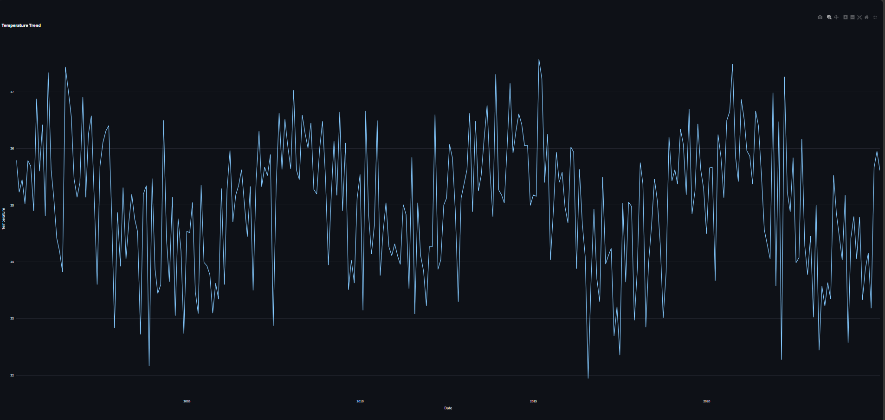
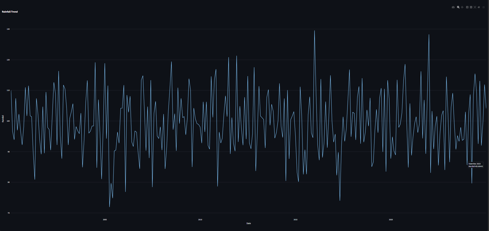
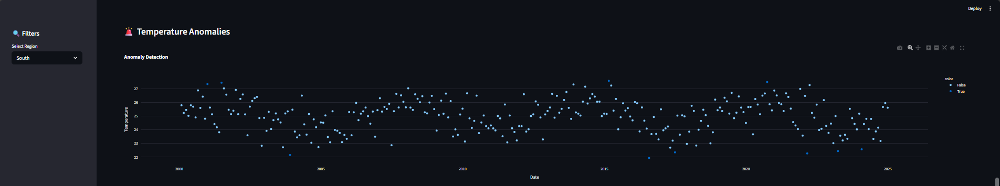
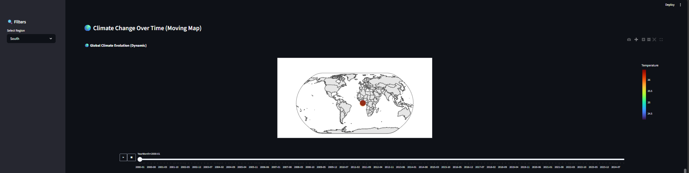
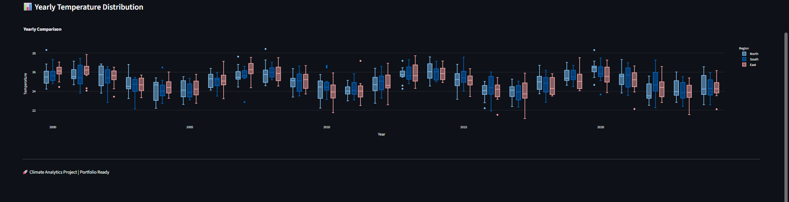
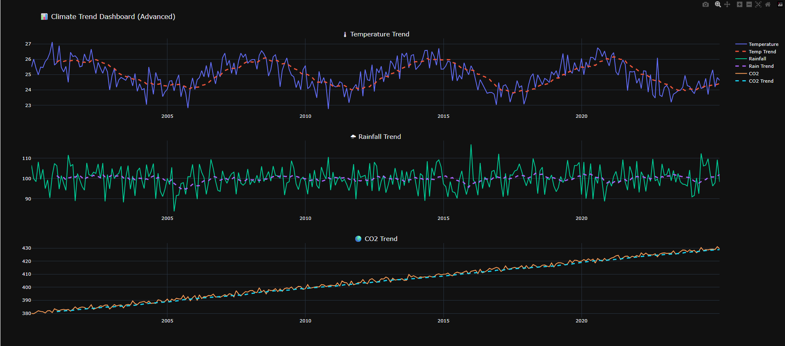

# 🌍 Climate Trend Analyzer (AI-Powered Climate Analytics System)

---

## 📌 Overview

This project is an **AI-powered Climate Trend Analyzer** designed to analyze historical climate data and uncover patterns such as temperature trends, rainfall variations, and climate anomalies.

The system simulates real-world climate analytics used by environmental agencies, smart cities, and research organizations to monitor climate change and support data-driven decision-making.

---

## 🚀 Key Features

* 📊 Time-series climate trend analysis
* 🌡 Temperature, Rainfall & CO₂ insights
* 🚨 Anomaly detection using statistical methods
* 🔮 Climate forecasting using time-series modeling
* 🌍 Animated global map visualization
* 📈 Multiple interactive graphs
* 🌐 Streamlit dashboard (industry-level UI)
* ⚡ Real-time filtering by region

---

## 🔄 System Workflow

**Data Collection → Data Cleaning → Feature Engineering → Trend Analysis → Anomaly Detection → Forecasting → Visualization → Dashboard**

### Step-by-step:

1. Load climate dataset (synthetic or real)
2. Clean missing and inconsistent values
3. Convert date & extract time features
4. Perform exploratory data analysis (EDA)
5. Detect climate anomalies using Z-score
6. Apply time-series forecasting (ARIMA)
7. Generate visualizations
8. Display results in Streamlit dashboard

---

## 🧠 Tech Stack

| Category         | Tools Used         |
| ---------------- | ------------------ |
| Programming      | Python             |
| Data Handling    | Pandas, NumPy      |
| Visualization    | Matplotlib, Plotly |
| Machine Learning | Scikit-learn       |
| Time Series      | Statsmodels        |
| Dashboard        | Streamlit          |
| Version Control  | Git & GitHub       |

---

## 🤖 Model & Analysis Details

### 🔹 Techniques Used:

* Time-Series Analysis
* Rolling Mean Trend Analysis
* Z-score based Anomaly Detection
* ARIMA Forecasting

### 🔹 Input Features:

* Date
* Temperature
* Rainfall
* CO₂ Levels
* Region

### 🔹 Output:

* Climate trends
* Detected anomalies
* Forecasted temperature values

---

## 📊 Outputs

### ✔ Insights Generated:

* Long-term temperature trends
* Seasonal rainfall variations
* Climate anomalies
* Future temperature predictions

### ✔ Graphs Generated:

* 🌡 Temperature Trend
* 🌧 Rainfall Trend
* 🌍 CO₂ Trend
* 🚨 Anomaly Detection
* 📊 Yearly Comparison
* 🌎 Animated Global Map

---

## 📸 Output Screenshots

### 🌡 Temperature Trend



### 🌧 Rainfall Trend



### 🚨 Anomaly Detection



### 🌍 Animated Climate Map



### 📊 Yearly Analysis



### 🌐 Dashboard View



---

## 🖥️ Demo

Run the main pipeline:

```bash
python main.py
```

Run the dashboard:

```bash
streamlit run app/app.py
```

Open in browser:

```
http://localhost:8501
```

---

## ⚠️ Important Notes

* Dataset must be placed inside:

```
data/climate_data.csv
```

* Install dependencies:

```bash
pip install -r requirements.txt
```

* Large files (models, datasets) can be ignored using `.gitignore`

---

## 📁 Project Structure

```
Climate-Trend-Analyzer/
│
├── app/
│   └── app.py
│
├── data/
│   └── climate_data.csv
│
├── images/
│   └── (screenshots)
│
├── outputs/
│   ├── plots/
│   └── reports/
│
├── src/
│   ├── analysis.py
│   ├── anomaly.py
│   ├── data_loader.py
│   ├── forecast.py
│   ├── insights.py
│   ├── preprocess.py
│   └── report.py
│
├── generate_data.py
├── main.py
├── requirements.txt
├── README.md
└── .gitignore
```

---

## ▶️ How to Run

### Step 1: Clone Repository

```bash
git clone https://github.com/YOUR_USERNAME/climate-trend-analyzer.git
cd climate-trend-analyzer
```

### Step 2: Create Virtual Environment

```bash
python -m venv venv
```

### Step 3: Activate Environment

**Windows:**

```bash
venv\Scripts\activate
```

**Mac/Linux:**

```bash
source venv/bin/activate
```

### Step 4: Install Dependencies

```bash
pip install -r requirements.txt
```

### Step 5: Run Project

```bash
python main.py
```

### Step 6: Run Dashboard

```bash
streamlit run app/app.py
```

---

## 🎯 Conclusion

This project demonstrates how data science and machine learning can be used to analyze climate data and generate meaningful environmental insights.

It provides hands-on experience in:

* Data preprocessing
* Time-series analysis
* Anomaly detection
* Forecasting
* Data visualization
* Dashboard development

---

## 👨‍💻 Author

**Yusra Sheikh Ashfaq**

---


